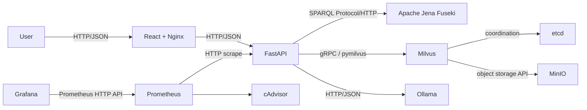

# Ontology-Driven AI Pilot

A runnable master’s-project proof of concept that combines an OWL/RDF organizational knowledge graph, semantic vector search, and a local LLM. Every answer exposes graph facts, semantic matches, sources, timings, and bounded relationship paths. If the external KG2QA dataset is absent, the 43-entity fictional sample remains fully usable.

## Research motivation

The pilot evaluates whether explicit ontology structure improves evidence recall and traceability over vector retrieval alone. Its deterministic evaluator compares `vector_only`, `graph_only`, and `hybrid`; confidence is an explainable evidence heuristic, **not a calibrated probability**.



Fuseki is authoritative; Milvus is a derived index. The frontend never contacts data or model services. Hybrid ranking uses `0.55 × normalized vector score + 0.45 × graph relevance`, configurable with weights that must sum to one. Generated SPARQL is never executed.

## Stack and pinned images

Python 3.12, FastAPI 0.115, Pydantic 2, RDFLib 7, pymilvus 2.5, sentence-transformers 3.3; React 18, TypeScript 5.7, Vite 6, TanStack Query, Cytoscape; Jena Fuseki 5.2.0, Milvus 2.5.3, etcd 3.5.16, MinIO 2024-12-18, Ollama 0.5.4, Prometheus 3.0.1, Grafana 11.4.0, cAdvisor 0.49.2.

## Prerequisites and quick start

Docker Engine with Compose v2, 16 GB RAM minimum (24 GB recommended for the default embedding and LLM models), and internet access on first use:

```bash
cp .env.example .env
docker compose up -d --build
docker compose --profile tools run --rm data-loader --dataset sample --reset --load-graph --load-vectors
./scripts/smoke_test.sh
```

On Windows use `Copy-Item .env.example .env` and `./scripts/bootstrap.ps1`. Base Compose is CPU-only. GPU mode requires NVIDIA Container Toolkit:

```bash
docker compose -f compose.yaml -f compose.gpu.yaml up -d --build
```

The Ollama initializer checks before pulling `qwen2.5:7b`; a temporary pull failure does not tear down the deployment. The first embedding operation downloads `intfloat/multilingual-e5-large` into the persistent Hugging Face volume.

## Dataset and ingestion

Put KG2QA files under `data/KG2QA_ontology_dataset/` (mounted at `/app/data/KG2QA_ontology_dataset`). RDF/TTL/OWL, entity/relationship CSV, QA JSON/CSV, and text files are discovered rather than assumed. Common source/target/relation column aliases are accepted. With no usable files, `ENABLE_SAMPLE_FALLBACK=true` selects the organizational demo and reports a warning.

```bash
docker compose --profile tools run --rm data-loader --dataset sample --reset --load-graph --load-vectors
docker compose --profile tools run --rm data-loader --dataset kg2qa --reset --load-graph --load-vectors
```

Omit `--reset` for deterministic upserts. See [ingestion details](docs/ingestion.md) and [ontology](docs/ontology.md).

## API and example usage

OpenAPI is at `http://localhost:8000/docs`. Retrieval continues without Ollama; chat returns `partial` if generation fails. Graph-only survives Milvus failure, vector-only survives Fuseki failure, and two failed retrievers produce structured 503 output.

```bash
curl -H 'Content-Type: application/json' -d '{"question":"Which vendor supplies the system used by Project Atlas?","mode":"hybrid"}' http://localhost:8000/api/v1/chat
```

Try Project Atlas sponsorship, its system vendor, the manager of the Case Management System owner, Riyadh employees’ projects, and Finance-owned systems. The CEO restaurant question should return insufficient evidence.

## Evaluation and development

```bash
make lint
make test
make typecheck
make evaluate
```

The 15-question corpus covers direct, relationship, multi-hop, aggregation, and unanswerable cases. Results are written to `data/evaluation-results/latest.json`. Metrics include keyword coverage, entity/path recall, token F1 utilities, evidence precision, unsupported-claim heuristic, and latency; no subjective judge is presented as ground truth. See [evaluation](docs/evaluation.md).

## URLs

- UI `http://localhost:3000`
- API/OpenAPI `http://localhost:8000/docs`
- Fuseki `http://localhost:3030`
- Attu `http://localhost:8001`
- Ollama `http://localhost:11434`
- Prometheus `http://localhost:9090`
- Grafana `http://localhost:3001` (development credentials from `.env`)
- cAdvisor `http://localhost:8080`

## Air-gapped preparation

The project is offline-capable only after all artifacts are staged. On an internet-connected Linux host:

```bash
docker compose pull
docker compose build
docker compose up -d ollama
docker compose exec ollama ollama pull qwen2.5:7b
docker compose --profile tools run --rm data-loader python /app/scripts/download_embedding_model.py
docker save $(docker compose config --images) -o ontology-pilot-images.tar
docker run --rm -v ontology-ai-pilot_ollama-models:/source:ro -v "$PWD:/out" alpine tar czf /out/ollama-models.tgz -C /source .
docker run --rm -v ontology-ai-pilot_hf-models:/source:ro -v "$PWD:/out" alpine tar czf /out/hf-models.tgz -C /source .
```

Transfer the repository, dataset, tar files, and `.env`; run `docker load -i ontology-pilot-images.tar`, recreate the two named volumes, restore their archives, and start Compose with no pulls. Exporting locally built `backend` and `frontend` images may require explicitly tagging and adding them to `docker save`.

## Security, troubleshooting, and limitations

All included passwords are insecure development defaults; change them. Keep data services behind a firewall, terminate TLS at a reverse proxy, rotate credentials, restrict host ports, scan images, back up volumes, and use a secrets manager before shared use. Reset requires `X-Admin-Token`. Input, traversal, result, and context sizes are bounded; credentials and prompts are not logged.

The heuristic entity extractor and bounded templates do not replace a full semantic parser; multilingual quality follows the selected models; ontology reasoning is limited to stored/inferred data; no HA, identity platform, or calibrated confidence is provided. See [troubleshooting](docs/troubleshooting.md). Future research can add reasoner materialization, learned fusion, multilingual benchmarks, temporal/provenance ontologies, and calibrated abstention.

## Repository map

`backend/` contains API, retrieval, ingestion, evaluation, and tests; `frontend/` contains the four-page client; `data/` sample and KG2QA mount; `fuseki/` ontology notes; `monitoring/` provisioned Prometheus/Grafana; `scripts/` cross-platform workflows; `docs/` design references. Commands are summarized by `make help`.

