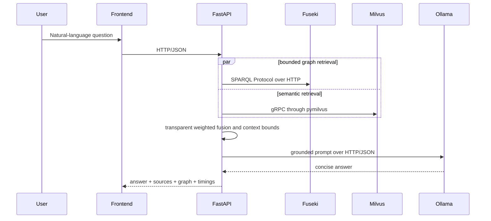

# Architecture

Milvus uses etcd for internal coordination and MinIO's object storage API. Prometheus scrapes HTTP metrics; Grafana queries the Prometheus HTTP API. Failure boundaries deliberately retain either retrieval mode and treat generation as optional after evidence retrieval.

